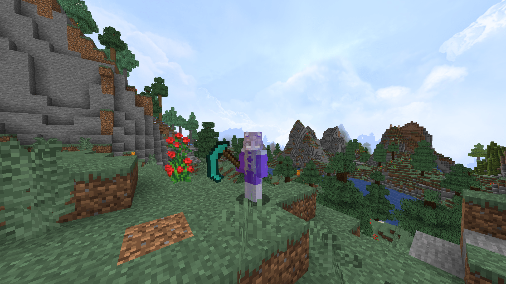

# Maulve's Scythes

A Vanilla+ mod that add scythes.

These include:
- Iron Scythe
- Diamond Scythe
- Netherite Scythe
- Amethyst Scythe

This mod might be updated in the future with drastic changes.

Also, this is the first mod I've ever made. Currently there's no plan to maintain Minecraft versions
other that 1.20.4.
