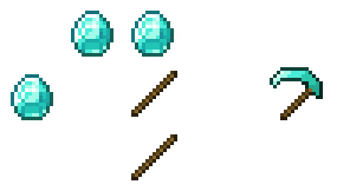

Maulve's Scythes is a Vanilla+ mod that adds scythes as new weapons. These slightly differ from swords, because they always sweep attack.
You can also mine crops and other plant blocks in a 3x2 area!

---
## Content

This mod adds various items, including - of course - scythes.

- Iron Scythe
- Diamond Scythe
- Netherite Scythe
- Amethyst Scythe

These are required to craft the Amethyst Scythe:
- Reinforced Stick
- Scythed Amethyst

Also: Enchantments!
- Life Drain (heals player when killing a mob)
- Sweeping Arc (increases sweeping range)

--- 
## Crafting

---
## Roadmap

Currently, planned support is until 1.22 comes out.
Until then I want to release one more major content update:

### 1.4 (March 2025)
- full configuration
- scythes in loot tables (likely end cities and ancient cities)
- further balancingaulve's Scythes is a Vanilla+ Mod that adds Scythes as new weapons.

Scythes slightly differ from swords, they always sweep attack.

Base Crafting recipe (also works mirrored!)

The crafting recipe of the Diamond Scythe, showing 2 sticks and 3 diamonds in a scythe shape.
Maulve's Scythes adds the following Scythes:

    Iron Scythe
